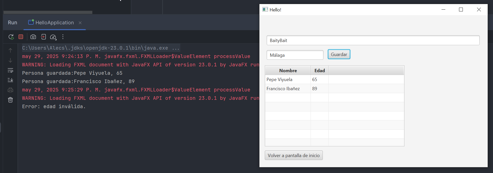
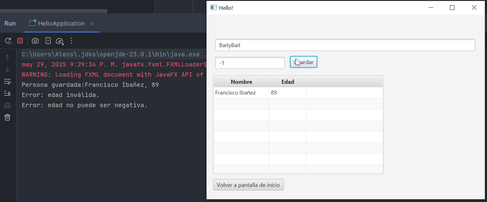

# JavaFX Introducción

Pruebas

---

Podemos observar, por el mensaje de advertencia que sale cada vez que cambiamos a la segunda pantalla, que tenemos persistencia de datos.

También podemos observar por el mensaje de error que estamos manejando el error de introducir texto en vez de números.

---

En este otro ejemplo, podemos observar que tampoco dejamos que tenga años negativos.
